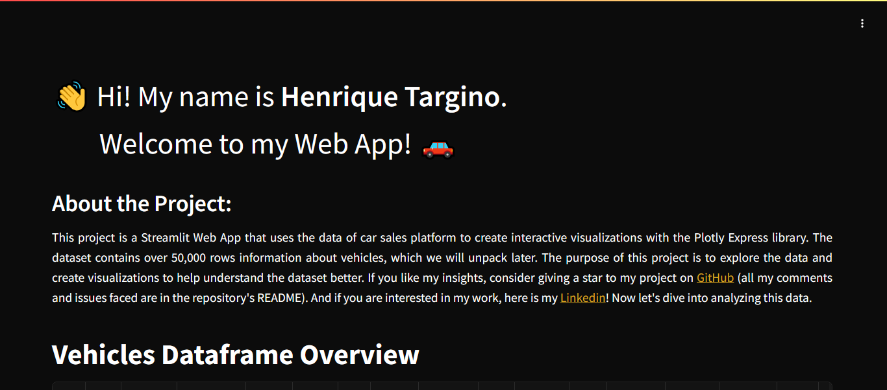
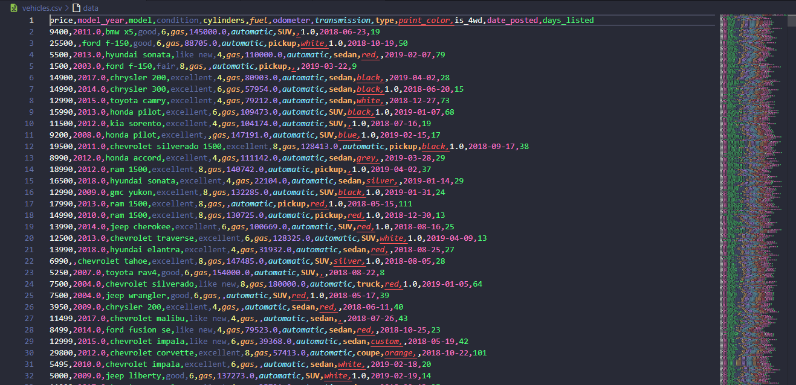

# Vehicles Data Analysis



## Overview

This web application is designed to provide an interactive and insightful analysis of vehicle data. Built using Streamlit, Plotly Express, and Pandas, it allows users to explore various aspects of car sales data through dynamic visualizations and statistical analyses. The app covers a range of topics, including price distribution by brand, car type distribution, fuel type analysis, and sales performance metrics. Additionally, it offers tools for downloading the dataset and performing advanced statistical tests like ANOVA and Tukey's HSD. Whether you're a car enthusiast, data analyst, or just curious about vehicle trends, this app provides a comprehensive platform for exploring and understanding car sales data.

## Problems Faced

I encountered some problems while performing the Exploratory Data Analysis (EDA). The first issue was how to handle the missing values. More than 25,000 values were missing (about 10,000 in the "paint_color" column), so I replaced them with the term "unknown". The remaining 15,000 missing values were in the "model_year", "cylinders", and "odometer" columns. I filled the missing values in "cylinders" with the mode of the car model, "model_year" based on the car's condition and mileage, and "odometer" based on the year of manufacture. Another issue was with the Mercedes-Benz brand; the dataset contained only 40 rows of data for this brand and only 2 different cars, so I decided to exclude it from the analysis. More than 800 cars were listed with a price of USD $1, so I removed all cars priced below USD $100. Finally, the most challenging problem was that the web app would not open and displayed a red error screen. I spent an entire day trying to resolve this issue. Initially, I thought it was related to the style.css file, so I tried embedding the CSS, removing it, but nothing worked. Fortunately, I opened the same link on my mobile phone, and it did not return an error. I cleared the Google Chrome cache, and the web app started working.

## Features

- **Interactive Visualizations**: Explore various aspects of car sales data through dynamic visualizations.
- **Statistical Analysis**: Perform advanced statistical tests like ANOVA and Tukey's HSD.
- **Data Download**: Download the dataset for further analysis.
- **Responsive Design**: The app is designed to be responsive and works well on different screen sizes.

## Technologies Used

- **Streamlit**: For building the web application.
- **Plotly Express**: For creating interactive visualizations.
- **Pandas**: For data manipulation and analysis.
- **Scipy**: For statistical analysis.
- **Statsmodels**: For performing ANOVA and Tukey's HSD tests.
- **Matplotlib**: For plotting the results of statistical tests.
- **Font Awesome**: For adding icons to the footer.
- **Jupyter Notebook**: For Exploratory Data Analysis (EDA).
- **CSS**: For the style of the web app.

## Installation

1. Clone the repository:
    ```bash
    git clone https://github.com/henriquetargino/vehicles.git
    cd vehicles
    ```

2. Create a virtual environment and activate it:
    ```bash
    python -m venv venv
    source venv/bin/activate  # On Windows use `venv\Scripts\activate`
    ```

3. Install the required dependencies:
    ```bash
    pip install -r requirements.txt
    ```

## Usage

1. Run the Streamlit app:
    ```bash
    streamlit run app.py
    ```

2. Open your web browser and go to `http://localhost:10000` to view the app.

## Dataframe Screenshot



## Contact

Developed by Henrique Targino

- **Email**: [henriquetarginoalbuquerque@gmail.com](mailto:henriquetarginoalbuquerque@gmail.com)
- **GitHub**: [henriquetargino](https://github.com/henriquetargino)
- **Linkedin**: [Henrique Targino](https://www.linkedin.com/in/henriquetargino/)

## License

This project is licensed under the MIT License. See the LICENSE file for more details.
