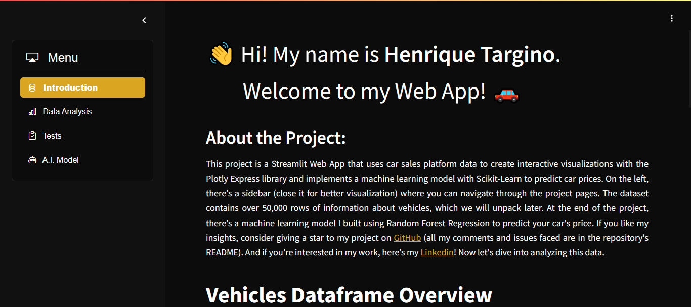

# Vehicles Data Analysis



## Interactive Graphs


## A.I. Model to Predict Car Prices


## Overview

This web application is designed to provide an interactive and insightful analysis of vehicle data. Built using Streamlit, Plotly Express, and Pandas, it allows users to explore various aspects of car sales data through dynamic visualizations and statistical analyses. A machine learning model, developed with Scikit-learn, is also included to predict car prices based on features like brand, year, mileage, and fuel type. The app covers a range of topics, including price distribution by brand, car type distribution, fuel type analysis, and sales performance metrics. Additionally, it offers tools for downloading the dataset and performing advanced statistical tests like ANOVA and Tukey's HSD. Whether you're a car enthusiast, data analyst, or just curious about vehicle trends, this app provides a comprehensive platform for exploring and understanding car sales data.

## Problems Faced

I encountered several challenges during the Exploratory Data Analysis (EDA). The first issue was handling missing values. Over 25,000 values were missing, including 10,000 in the "paint_color" column, which I replaced with "unknown." For the remaining 15,000 missing values in "model_year," "cylinders," and "odometer," I filled them based on the mode of the car model, the car's condition and mileage, and the year of manufacture, respectively. Additionally, the Mercedes-Benz brand had only 40 rows of data for two car models, so I excluded it from the analysis. I also removed over 800 cars priced below USD $100, as they were likely unreal outliers.

Finding a reliable machine learning model was another challenge. While testing Random Forest Regression, it was difficult to balance speed and accuracy. I also tried Linear Regression, but its accuracy was poor, making it unsuitable for predicting car prices. Lastly, my web app initially wouldn’t open, displaying a red error screen. I spent hours troubleshooting, thinking it was related to the CSS file, but later discovered the issue was with my browser. Clearing the Google Chrome cache resolved the problem.

## Features

- **Interactive Visualizations**: Explore various aspects of car sales data through dynamic visualizations.
- **Statistical Analysis**: Perform advanced statistical tests like ANOVA and Tukey's HSD.
- **Data Download**: Download the dataset for further analysis.
- **Responsive Design**: The app is designed to be responsive and works well on different screen sizes.
- **Machine Learning Model**: Predict car prices based on features like brand, year, mileage, fuel type and more.

## Technologies Used

- **Streamlit**: For building the web application.
- **Plotly Express**: For creating interactive visualizations.
- **Pandas**: For data manipulation and analysis.
- **Scipy**: For statistical analysis.
- **Statsmodels**: For performing ANOVA and Tukey's HSD tests.
- **Matplotlib**: For plotting the results of statistical tests.
- **Font Awesome**: For adding icons to the footer.
- **Jupyter Notebook**: For Exploratory Data Analysis (EDA).
- **CSS**: For the style of the web app.
- **Scikit-Learning**: For training machine learning models.

## Installation

1. Clone the repository:
    ```bash
    git clone https://github.com/henriquetargino/vehicles.git
    cd vehicles
    ```

2. Create a virtual environment and activate it:
    ```bash
    python -m venv venv
    source venv/bin/activate  # On Windows use `venv\Scripts\activate`
    ```

3. Install the required dependencies:
    ```bash
    pip install -r requirements.txt
    ```

## Usage

1. Run the Streamlit app:
    ```bash
    streamlit run app.py
    ```

2. Open your web browser and go to `http://localhost:10000` to view the app.

## Dataframe Screenshot


## Contact

Developed by Henrique Targino

- **Email**: [henriquetarginoalbuquerque@gmail.com](mailto:henriquetarginoalbuquerque@gmail.com)
- **GitHub**: [henriquetargino](https://github.com/henriquetargino)
- **Linkedin**: [Henrique Targino](https://www.linkedin.com/in/henriquetargino/)

## License

This project is licensed under the MIT License. See the LICENSE file for more details.
